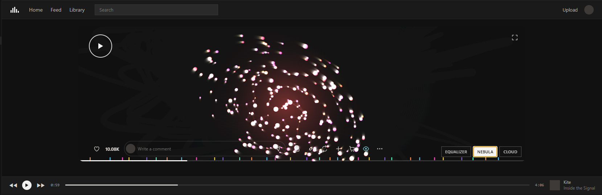

# concept-visualizer

A personal exploration of what an audio-reactive visualizer could look
like inside a track-player UI, built as a framework-agnostic,
zero-dependency Web Component (`<av-visualizer>`) — three distinct visual
styles, each driven by genuine bass/mid/treble analysis of the signal via
the Web Audio API, rather than simulated or fake-beat levels.

The demo page (`demo/index.html`) borrows a familiar dark player layout as
a design testbed for the component, and one of the three visual styles
(Cloud) is a visual homage to a recognizable player-brand mark. This
project isn't affiliated with, endorsed by, or trying to replicate any
particular product.



## Quick start

```html
<script type="module" src="./dist/av-visualizer.js"></script>

<av-visualizer id="viz" style-name="equalizer" accent="#7fd8e0"></av-visualizer>
<audio id="track" src="song.mp3"></audio>
<button id="playButton">Play</button>

<script type="module">
  const viz = document.getElementById('viz');
  const audio = document.getElementById('track');
  viz.mediaElement = audio;

  document.getElementById('playButton').addEventListener('click', () => {
    audio.play();
    viz.activate(); // resumes the AudioContext (must follow a user gesture)
  });
</script>
```

Or as a plain script tag (no module system required):
```html
<script src="./dist/av-visualizer.iife.js"></script>
```

## Why this integrates cleanly regardless of the host's stack

The component's only real dependency is a standard Web Audio integration
seam, not anything about the host application's framework or internals.
It accepts either:

- **`viz.mediaElement = someAudioElement`** — the common case. The
  component creates its own `MediaElementSourceNode`, guarded so
  reassigning the same element never throws (the Web Audio API throws if
  you call `createMediaElementSource` twice on one element).
- **`viz.audioNode = someExistingAudioNode`** — for a host that already
  runs its own Web Audio graph (its own analyser, effects chain, etc.).
  The component taps on via `.connect()`, which fans out without
  disturbing any of the host's existing connections.

Both are browser standards, identical no matter what rendered the
surrounding page. There is nothing SoundCloud-specific (or
React-specific, or anything-specific) baked into the component — an
integrator hands it a reference to the audio that's actually playing, and
it works.

## API

### Attributes

| Attribute | Values | Description |
|---|---|---|
| `style-name` | `equalizer` \| `nebula` \| `cloud` | Active visual style. |
| `active` | boolean (presence) | Whether the render loop is running. |
| `accent` | CSS color | Accent color used by all three renderers. |

> **Why `style-name` and not `style`:** `style` is a reserved built-in
> property on every `HTMLElement` (the inline `CSSStyleDeclaration`).
> Naming the attribute `style` would shadow it and break normal DOM usage
> like `el.style.display = 'none'`. This is a deliberate deviation from
> earlier draft wording, not an oversight.

### Properties

- `.mediaElement = HTMLMediaElement` — assign the `<audio>`/`<video>`
  element to analyze (setter; creates and reuses one source node per
  element).
- `.audioNode = AudioNode` — assign an existing Web Audio node to tap
  into instead.
- `.accent` — read the current accent color.

### Methods

- `.setStyle(name)` — switch the active renderer (`'equalizer'` |
  `'nebula'` | `'cloud'`).
- `.activate()` — resumes the underlying `AudioContext` (call from a user
  gesture, per browser autoplay policy) and starts the render loop.
- `.deactivate()` — stops the render loop.

### Ownership boundary

The component owns the canvas and the 3-way style-switcher chip UI. It
does **not** own a WAVEFORM/VISUALIZER mode toggle — that chrome belongs
to the host page (see `demo/index.html` for a full worked example of a
host wiring that up around the component).

## The 3 visual styles

- **Equalizer** — a vertical bar spectrum. Bar count scales with the
  canvas width (about one bar per 12px) so it fills the available space at
  any size instead of a fixed count stretched thin. Each bar's slice of
  the spectrum is chosen on a log scale — an equal frequency *ratio* per
  bar rather than an equal bin count — so bass, mid, and treble read as an
  evenly segmented spread instead of bass being crushed into one or two
  bars while treble blurs into an averaged blob.
- **Nebula** — a spiral-armed particle field with real depth: each
  particle has its own z, and the camera moves through that volume via
  perspective projection, producing genuine parallax. Bass triggers a
  brief depth "flyover" toward one particle; mid drives spin and hue-cycle
  speed; treble adds per-particle sparkle plus short-range constellation
  lines between particles that are close together on screen.
- **Cloud** — a shape inspired by a familiar player-brand mark: a row of
  vertical bars blending into a rounded body, each bar's height driven by
  the real frequency spectrum around a rest-height envelope shaped like
  the source mark, so it stays recognizable at rest and comes alive with
  the music. Bass swells the whole mark; treble flashes it bright on
  transients.

## How the audio analysis works

One `AnalyserNode` per component instance (not three separate filter
chains — cheaper, and its FFT output already contains everything needed).
Its frequency-domain data is used two ways every frame:

- **Raw per-bin spectrum** → the Equalizer and Cloud renderers' bars.
- **Bucketed into 3 Hz ranges** (bass 20-250Hz, mid 250-4000Hz, treble
  4000Hz-Nyquist (~22kHz at the default 44.1kHz sample rate)) → Nebula's
  and Cloud's macro reactivity.

Each band is smoothed with a fast-attack/slow-decay envelope so the
visuals don't flicker frame to frame. See `src/audio-engine.js` for the
implementation and `test/audio-engine.test.js` for the coverage of this
math.

## Browser support

Requires the Web Audio API and Custom Elements (all evergreen browsers).
Check `AvVisualizer.isSupported` before relying on analysis — the
component simply won't animate if it's unavailable, it won't throw. (This
is a static proxy for `AudioEngine.isSupported`; if you're importing from
`src/` directly rather than the bundle, `AudioEngine.isSupported` — from
`src/audio-engine.js` — works too.)

This module touches `document`/`customElements` at import time and is not
SSR-safe — import it only in client-side code (e.g. behind a dynamic
`import()` or a client-only entry point in frameworks that pre-render on
the server).

## Cross-origin audio

If the `<audio>`/`<video>` element's source is on a different origin than
the page, set `crossorigin="anonymous"` on the element and ensure the
server sends appropriate CORS headers (`Access-Control-Allow-Origin`).
Without this, the browser still plays the audio but `getByteFrequencyData`
returns all-zero data (and some browsers mute the routed output entirely)
— the visualizer will appear frozen/silent even though playback works.
This is a browser security restriction (the Web Audio API refuses to
expose cross-origin sample data without explicit CORS opt-in), not
anything this component can work around.

## Project structure

```
src/
  audio-engine.js         AudioContext/AnalyserNode wrapper + pure band math
  visualizers/
    equalizer.js           log-scale bar spectrum renderer
    nebula.js               3D-parallax particle field renderer
    cloud.js                 bar-and-mark shape renderer
  av-visualizer.js         the custom element (shadow DOM)
demo/
  index.html               a full worked integration example
  main.js
scripts/
  build.mjs                esbuild bundling
test/
  audio-engine.test.js      unit tests for the pure math
```

## Development

```bash
npm install
npm test          # runs the audio-engine unit tests
npm run build     # bundles src/ into dist/
```

To run the demo: serve the project root with any static file server (for
example `npx serve .`) and open `demo/index.html` — drop an audio file at
`demo/audio/track.mp3` first (see `demo/audio/README.md`) to hear it
react to real playback.

## Testing scope

The audio-engine's pure math (Hz→bin bucketing, band averaging, envelope
smoothing, the source-node reuse guard) is unit tested. The three renderers are inherently visual and
are verified by eye on the demo page rather than pixel-tested.

## Contributing

See [CONTRIBUTING.md](./CONTRIBUTING.md) for development setup, testing,
and build instructions.

## License

Proprietary — all rights reserved. See [LICENSE](./LICENSE).
